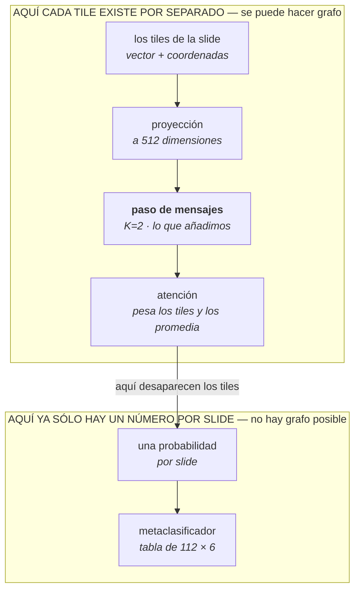

# Protocolo del brazo espacial

**Patho-Ensemble · cptac_brca / TP53_mutation · 50 folds**

Qué estamos probando al meter un grafo en el pipeline, explicado sin dar por supuesto
nada sobre grafos; con qué parámetros se controla y qué significa cada término que sale
en los logs.

> Versión HTML con diagramas: [`PROTOCOLO_BRAZO_ESPACIAL.html`](PROTOCOLO_BRAZO_ESPACIAL.html)

---

## El problema, antes de hablar de grafos

Una biopsia digitalizada es una imagen enorme, así que se trocea en miles de cuadraditos
—los **tiles**— y cada uno se convierte en un vector de números con un modelo fundacional.
Una slide típica de este dataset da unos **7 000 tiles**.

El modelo que tenemos, ABMIL, aprende a puntuar cada tile por lo informativo que es y luego
promedia toda la slide con esos pesos. Funciona bien, pero tiene una limitación que se ve al
enunciarla: trata los 7 000 tiles como una **bolsa desordenada**. Si barajaras los tiles de
una slide como quien baraja una baraja, el modelo daría exactamente la misma respuesta. No
sabe cuáles estaban pegados a cuáles.

Y en patología eso es tirar información. Un tumor no es un puñado de células sueltas
repartidas al azar: forma nidos. La inflamación forma frentes. Un tile «sospechoso» rodeado
de tejido sano no significa lo mismo que ese mismo tile rodeado de otros veinte igual de
sospechosos. Esa diferencia, hoy, el modelo no puede verla.

La buena noticia es que la información para verla **ya estaba guardada**: cada tile tiene sus
coordenadas en el fichero `.h5`, alineadas fila a fila con su vector. Nadie las leía.

---

## Qué es un grafo aquí

Un grafo es simplemente *un conjunto de cosas y qué cosas están conectadas con cuáles*. Nada
más. En nuestro caso los **nodos** son los tiles, y las **aristas** unen cada tile con los que
tiene pegados en la slide. Como los tiles se recortaron en cuadrícula regular, «pegado» es
literal: cada tile tiene hasta 8 vecinos, los de arriba, abajo, los lados y las diagonales.

```
  La slide, troceada                    El mismo trozo, como grafo

  ┌────┬────┬────┬────┐                    o     o     o
  │ ·  │ N  │ N  │ N  │                     \    |    /
  ├────┼────┼────┼────┤                      \   |   /
  │ ·  │////│ T  │ N  │  ← hueco: aquí        o--[T]--o
  ├────┼────┼────┼────┤    no hay tejido     /   |   \
  │ ·  │ N  │ N  │ N  │                     /    |    \
  ├────┼────┼────┼────┤                    o     o     o
  │    │ ·  │ ·  │ ·  │
  └────┴────┴────┴────┘                 T = el tile · o = sus vecinos

  T = el tile          N = sus 8 vecinos (aquí sólo 7)
  //// = sin tejido    ·  = otros tiles
```

El **grado** de un nodo es cuántos vecinos tiene. En el dibujo es 7 en vez de 8, porque uno de
los ocho sitios no tiene tejido.

Medido sobre las 112 slides de la tarea con `uni_v2`:

| Magnitud | Valor |
|---|---:|
| Grado medio | **7.78** de 8 |
| Tiles por slide (mediana) | 7 174 |
| Tiles totales | 923 403 |
| Nodos aislados | **0 %** |

El tejido es muy compacto: casi todos los tiles tienen sus ocho vecinos. Los que pierden
alguno están en el borde del tejido o junto a un hueco.

---

## Qué hace una GNN con ese grafo

Una red neuronal de grafos (GNN) hace una sola cosa, repetida: **cada nodo mira a sus vecinos
y mezcla la información de ellos con la suya**. A eso se le llama *message passing*, paso de
mensajes.

Una ronda de mensajes hace que cada tile sepa algo de los tiles pegados a él. Dos rondas y ya
sabe algo de los vecinos de sus vecinos, o sea de una ventana de 5×5 tiles a su alrededor. Es
exactamente lo que le faltaba al modelo: en vez de juzgar cada tile aislado, lo juzga *en su
contexto*.

El número de rondas se llama **K** y aquí es 2. No es arbitrario: cada tile cubre unas 112
micras de tejido, así que K=2 da un contexto de unas 560 micras — la escala de un nido tumoral
o de una banda de estroma. Poner K mucho más alto tiene un efecto conocido y malo: de tanto
promediar, todos los tiles acaban pareciéndose entre sí y se pierde justo la señal que se
buscaba.

Un detalle importante: **el grafo va antes de la atención, no en su lugar.** Primero cada tile
se entera de su vecindario, y después la atención decide cuáles pesan. Los dos mecanismos se
suman.

---

## Por qué no puede ir en el metaclasificador

La pregunta de partida era si la GNN podía usarse como **metaclasificador** — la pieza final
que combina las predicciones de los tres modelos base. La respuesta es que no, y conviene
entender por qué, porque no es «rendiría mal» sino **no hay nada que conectar**.

El metaclasificador no ve imágenes. Recibe una tabla de 112 filas (una por slide) y 6 columnas
(tres modelos × dos clases). En ese punto los tiles ya no existen: la atención los ha fundido
en un único número por slide mucho antes, y lo que se guarda en disco son sólo esas
probabilidades. No hay tiles que hacer nodos ni coordenadas que hacer aristas.



Como efecto secundario útil, el brazo espacial se comporta como «un modelo base más», así que
entra en el ensemble existente **sin modificar nada** del metaclasificador.

---

## Terminología

Ordenada de lo más general a lo más específico del código. Lo que va en formato de código es
literal y se puede buscar en el repo.

| Término | Qué es |
|---|---|
| **WSI** | *Whole Slide Image*: la biopsia digitalizada entera, de varios gigapíxeles. Demasiado grande para meterla en una red de una vez; de ahí el troceado. |
| **tile / parche** | Cada cuadradito de la WSI, aquí de 224 píxeles a 20 aumentos. Unas 112 micras de tejido real. |
| **embedding** | El vector de números en que un modelo fundacional convierte un tile. Entre 768 y 2560 números según el modelo. |
| **bolsa / bag** | Todos los tiles de una slide. La etiqueta (mutante o no) es de la **bolsa entera**: se sabe que la slide lo es, no qué tile lo delata. Eso es lo que hace el problema «multiple instance». |
| **ABMIL** | El modelo base actual. Aprende un peso por tile y promedia la bolsa con esos pesos. La «A» es de atención: es el mecanismo que decide qué tiles importan. |
| **GNN** | Red neuronal que opera sobre un grafo, haciendo que cada nodo mezcle información con sus vecinos. |
| **message passing** | La operación que hace eso. Una ronda = cada tile mira a sus vecinos inmediatos. |
| **K** | Cuántas rondas de mensajes. K=2 → cada tile ve una ventana de 5×5 a su alrededor. |
| **grado** | Cuántos vecinos tiene un tile. Máximo 8. El **grado medio** dice lo compacto que es el tejido: 7.78 en `uni_v2`. |
| **nodo aislado** | Un tile sin ningún vecino, suelto en medio de nada. Se trata aparte para que la capa lo deje intacto en vez de deformarlo. |
| **α (alpha)** | El único parámetro del brazo más simple: **cuánto** promediado espacial aplica. Empieza en 0 (o sea, sin nada de grafo) y el modelo decide si subirlo. Es el diagnóstico clave. |
| **coords** | Las coordenadas de cada tile, ya guardadas en el mismo `.h5` que los embeddings y en el mismo orden. Nadie las leía hasta ahora. |
| **fold** | Una partición train/test. Hay 50, y todas las slides de un mismo paciente caen siempre del mismo lado, para que no se filtre información. |
| **metaclasificador** | El modelo final que combina las predicciones de los modelos base. Sólo ve probabilidades. |
| **AUC** | La métrica principal. 0.5 es azar, 1.0 es perfecto. Los modelos aquí rondan 0.77–0.80 en test. |
| **MDE** | *Mínimo efecto detectable*. Con 50 folds ronda 0.008–0.036 de AUC. Una diferencia menor que eso **no se puede distinguir del ruido**, y hay que reportarla como acotada, no como inexistente. |
| **correlación (r)** | Cuánto se parecen las predicciones de dos modelos. Importa porque un modelo que predice casi lo mismo que otro no aporta nada al ensemble, por bueno que sea. |

---

## Los cuatro brazos

Un «brazo» es una variante que se entrena y se compara contra las demás. Van de menos a más
complejidad, y ese orden es la decisión de diseño más importante del protocolo.

El motivo: en este repo, **añadir capacidad ha empeorado los resultados de forma sistemática**
— siete modelos probados, y cuanto más complejo, peor, hasta perder 0.23 de AUC. Así que en vez
de empezar por la GNN grande, se empieza por la versión con **dos parámetros**. Si dos
parámetros no mueven nada, ninguna GNN lo hará, y lo habremos sabido en una hora de GPU en vez
de en una semana.

| Brazo | Qué hace | Parámetros | Coste |
|---|---|---:|---:|
| `abmil` | El modelo actual, sin grafo. Es la referencia. | — | ×1.00 |
| `smooth` | Mezcla cada tile con la media de sus vecinos, en la proporción α. Un solo número por capa. | **+2** | ×1.22 |
| `sage_bn` | Deja que la red aprenda *cómo* mezclar, pero con pocos parámetros. | +265 k | ×1.40 |
| `sage` | GNN completa y estándar (GraphSAGE). El extremo caro de la escalera. | +1.05 M | ×1.50 |

### El truco del α

`smooth` arranca con α = 0, que significa «no uses el grafo para nada»: en ese punto es
*exactamente* el modelo de siempre. Sólo se aleja de ahí si el entrenamiento encuentra motivo.

Eso convierte el α final en una respuesta legible sin estadística: **si acaba en ~0, el modelo
ha decidido por su cuenta que el contexto espacial no le sirve.** En los primeros folds de la
ejecución en curso está saliendo del orden de ±0.001.

---

## Los controles

Si el brazo con grafo mejora, hay dos explicaciones posibles y hay que poder distinguirlas: que
*la información espacial* ayude, o que simplemente hayamos añadido parámetros y cualquier cosa
habría mejorado. Los controles existen para separarlas.

| Control | En qué consiste | Qué descarta |
|---|---|---|
| `--shuffle_coords` | Se construye el grafo real y luego se **reasignan** los tiles a sus nodos al azar. Queda un grafo con la misma forma exacta, mismo número de conexiones y mismo coste — pero donde «vecino» ya no significa «pegado en la slide». | Que baste con promediar tiles cualesquiera. Si el brazo real gana a éste, es que importan los vecinos *concretos*. |
| `--graph_mode self` | Cada tile se conecta sólo consigo mismo. Mismos parámetros, ningún vecino. | Que la mejora venga de los pesos extra y no del vecindario. |

### Por qué se reasignan los tiles y no se barajan las coordenadas

Barajar las coordenadas y reconstruir el grafo daría *otro* grafo distinto, con otro número de
conexiones: al comparar estaríamos cambiando dos cosas a la vez. Reasignando los tiles sobre el
grafo real, la forma se conserva exacta por construcción y lo único que se rompe es la
correspondencia entre cada tile y su sitio.

La reasignación se deriva del identificador de la slide (sha256), así que es siempre la misma en
train y en test — si cambiara en cada época dejaría de ser un control y pasaría a ser data
augmentation.

---

## Parámetros

Van en `train_abmil.py`, y hay que repetir los mismos en `test_abmil.py` para que encuentre el
modelo entrenado y reconstruya el grafo idéntico.

| Flag | Por defecto | Qué controla |
|---|---|---|
| `--arch` | `abmil` | Cuál de los cuatro brazos. Con el valor por defecto ni se leen las coordenadas. |
| `--n_layers` | `2` | Las rondas de mensajes (K). |
| `--arch_tag` | vacío | Sufijo del directorio de salida. **Obligatorio** con grafo, para no escribir encima del modelo de referencia. |
| `--graph_mode` | `lattice` | Cómo se construyen las conexiones. `self` es un control. |
| `--shuffle_coords` | desactivado | Activa el control de reasignación. |

```bash
# entrenar el brazo espacial. Los datos salen de uni_v2,
# los resultados van a uni_v2_gnn_... para no tocar la referencia
python src/train_abmil.py \
    --foundational_model uni_v2 \
    --arch smooth --n_layers 2 --arch_tag gnn \
    --work_dir "$WORK_DIR" --train_source cptac_brca \
    --tissue_patching 20x_224px_0px_overlap \
    --task_name TP53_mutation --epochs 100 --fold all

# meterlo en el ensemble: entra como un modelo más,
# sin tocar una línea del metaclasificador
python src/ensemble4.py \
    --foundational_models ctranspath uni_v2 virchow_v1 uni_v2_gnn \
    --work_dir "$WORK_DIR" --train_source cptac_brca \
    --tissue_patching 20x_224px_0px_overlap --task_name TP53_mutation
```

Todo el protocolo se lanza con un solo job:

```bash
sbatch stage2_spatial_gnn.sbatch
MODEL=uni_v2 ARCH=sage_bn sbatch stage2_spatial_gnn.sbatch   # variantes
```

---

## Las etapas y sus puertas

Cada etapa acaba en una comprobación que puede cancelar el proyecto. Es deliberado: el desenlace
más probable es que el grafo no ayude, y en ese caso interesa saberlo pronto, barato, y con una
explicación de *por qué*.

**1. ¿Los grafos son correctos?** — ✅ superada

Construirlos sobre slides reales y verificar que miden lo que dicen: que los tiles caen en
cuadrícula, que el grado es plausible, que no hay tiles sueltos mal tratados, y que con α=0 el
modelo es indistinguible del original. No entrena nada.
→ `test_spatial_gnn.py`, `test_spatial_gnn.sbatch`

**2. ¿Hemos roto algo al tocar el motor?** — ✅ superada

Para meter el grafo hubo que modificar el motor de entrenamiento que produce *todos* los
resultados del repo. Hay que demostrar que sin grafo se comporta exactamente igual que antes.
**Resultado: 50 de 50 folds idénticos, ninguna predicción desplazada.**

**3. ¿Aporta algo distinto?** — ⏳ en curso

La puerta que decide. Se mide cuánto se parecen las predicciones del brazo espacial a las del
modelo de siempre:

- **r ≥ 0.92** → se parecen demasiado. Es el mismo callejón que ya hundió a los snapshots. Se para.
- **r ≤ 0.85** → son claramente distintas. Aporta diversidad nueva y se sigue.
- entre medias → marginal; se corren los controles antes de ampliar.

La referencia: tres modelos fundacionales distintos correlacionan entre sí a **r = 0.797**, y
los snapshots que ya fracasaron estaban en 0.92–0.98.

**4. ¿Es el espacio, o son los parámetros?** — pendiente

Sólo si la anterior abre. Se corren los dos controles sobre los mismos 50 folds y la ventaja del
brazo real sobre ellos tiene que superar el MDE para significar algo.

---

## Cómo se lee el resultado

El repo tiene un protocolo de análisis que existe por haberse equivocado antes, dos veces.
Merece la pena saber qué previene cada pieza.

| Se reporta | Qué error previene |
|---|---|
| Diferencia **fold a fold**, no medias sueltas | Comparar los dos modelos por separado, cada uno con su intervalo, ya ocultó un efecto real que sí existía. |
| Victorias, empates y derrotas, junto al MDE | Un «gana en 5 de 5 folds, p = 0.024» sonaba convincente y **no se repitió** al pasar a 50 folds: cambió de signo. Y los empates son muchos, porque cada fold tiene sólo 22 slides de test. |
| p corregida por comparaciones múltiples (Holm) | Si pruebas cuatro brazos, alguno «gana» por azar. La corrección lo descuenta. |

### Qué se espera

Lo más probable es un **nulo**: que el grafo no cambie nada medible. El repo lleva 39
configuraciones probadas sin ninguna significativa, y hay un motivo medido — los tres modelos
base ya aportan casi toda la diversidad que el ensemble puede aprovechar.

Un nulo bien acotado, con su MDE y con el α aprendido como explicación, es un resultado
publicable y no un fracaso. Lo que **no** sería aceptable es un nulo *indeterminado*, del que no
se pueda decir cuánto efecto se habría detectado.

---

## Por qué uni_v2 y no ctranspath

Los dos modelos trocean las mismas 112 slides, pero no conservan los mismos tiles. `ctranspath`
se queda con 1.7 veces menos, así que su cuadrícula tiene muchos más huecos: el grado medio baja
a 5.34 y aparece casi un 1 % de tiles completamente sueltos, hasta un 13 % en la slide más
pequeña.

| Magnitud | `uni_v2` | `ctranspath` |
|---|---:|---:|
| Tiles en las 112 slides | 923 403 | 536 784 |
| Tiles por slide (mediana) | 7 174 | 4 094 |
| Grado medio | **7.78** | 5.34 |
| Tiles sin ningún vecino | **0 %** | 0.96 % |

Probar la hipótesis espacial sobre el sustrato con *peor* vecindario sesgaría el experimento
hacia el nulo. Y siendo el nulo ya el desenlace más probable, el resultado no distinguiría «el
espacio no ayuda» de «no le dimos espacio suficiente». Por eso se corre sobre `uni_v2` aunque
`ctranspath` sea el doble de rápido.

---

## Ficheros

```
src/graph_utils.py            construcción del grafo desde coords, y los controles
src/spatial_abmil.py          los tres brazos con grafo (smooth / sage_bn / sage)
src/abmil_engine.py           motor de entrenamiento; acepta grafos, inerte sin ellos
src/train_abmil.py            flags --arch/--n_layers/--arch_tag/--graph_mode
src/test_abmil.py             meta-features del brazo espacial

test_spatial_gnn.py           puerta 1 — corrección de los grafos
test_spatial_gnn.sbatch       la misma, en GPU
stage2_spatial_gnn.sbatch     puertas 2 y 3 — inercia del motor y correlación
```

`src/ensemble4.py`, `src/meta_models.py` y `run_3_experiments_v2_improved.sbatch` **no
necesitan ningún cambio**: el brazo espacial entra como un modelo base más.
